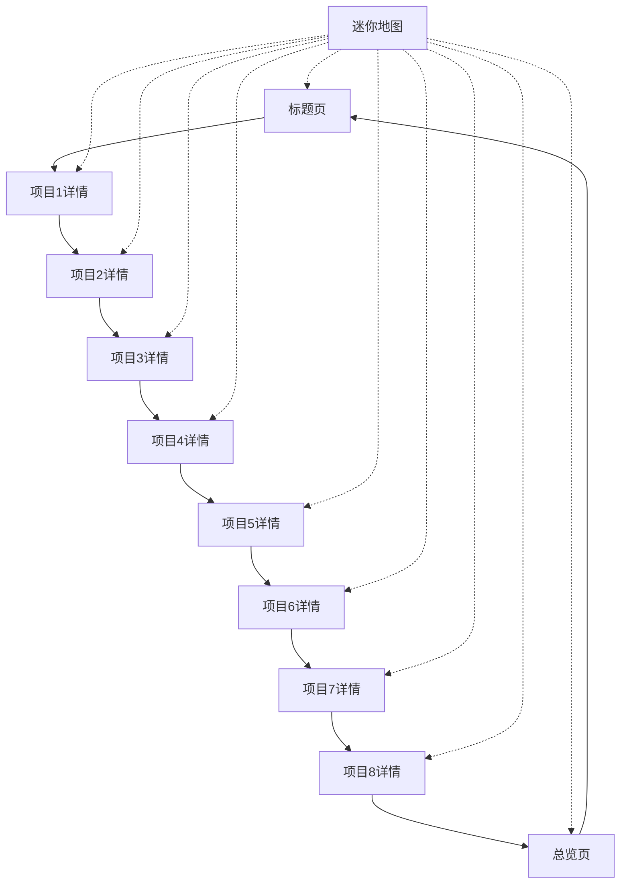

## 1. 产品概述

FolioSpaceVue 是原始 FolioSpace 项目的 Vue 3 完美复刻版本，保持原有的 3D 展示效果和交互逻辑不变，仅将技术栈从 React 迁移到 Vue 3。这是一个现代化的个人作品集展示工具，通过令人印象深刻的 3D 幻灯片效果展示项目作品。

- 帮助开发者创建具有沉浸式 3D 体验的个人作品集网站
- 目标用户：开发者、设计师、自由职业者等需要展示作品的人群
- 市场价值：提供独特的 3D 展示体验，让个人作品集更加吸引人和专业化

## 2. 核心功能

### 2.1 用户角色
本项目为单用户展示系统，无需区分不同角色。用户通过配置文件自定义个人信息和项目数据。

### 2.2 功能模块

FolioSpaceVue 包含以下核心页面：

1. **标题页**：个人介绍页面，展示头像、姓名、简介和社交链接
2. **项目详情页**：每个项目的详细介绍，包含项目截图、技术栈、描述和外部链接
3. **项目总览页**：所有项目的缩略图网格展示，支持快速导航

### 2.3 页面详情

| 页面名称 | 模块名称 | 功能描述 |
|---------|----------|----------|
| 标题页 | 个人信息区 | 显示头像、姓名、简介文本，支持社交链接跳转 |
| 标题页 | 导航提示 | 显示向下滚动提示，引导用户浏览项目 |
| 项目详情页 | 项目展示 | 展示项目截图、名称、描述、技术栈标签 |
| 项目详情页 | 外部链接 | 提供演示链接、源码链接等外部跳转 |
| 项目总览页 | 网格布局 | 以卡片形式展示所有项目缩略图 |
| 项目总览页 | 快速导航 | 点击项目卡片直接跳转到对应项目详情 |
| 全局组件 | 迷你地图 | 显示当前位置和所有项目节点，支持点击跳转 |
| 全局组件 | 进度条 | 显示当前浏览进度 |
| 全局组件 | 工具栏 | 提供导航控制按钮和主题切换 |

## 3. 核心流程

### 3.1 用户浏览流程
1. 用户进入网站，首先看到个人标题页
2. 可以通过键盘方向键、空格键或鼠标点击进行导航
3. 浏览各个项目详情页，了解项目信息
4. 进入总览页查看所有项目缩略图
5. 使用迷你地图快速跳转到任意项目
6. 支持循环浏览，形成完整的展示闭环

### 3.2 导航交互流程

## 4. 用户界面设计

### 4.1 设计样式
- **主色调**：现代渐变紫蓝色 (#6366F1, #8B5CF6)
- **辅助色**：浅紫色 (#A78BFA) 和深色模式下的亮蓝色 (#818CF8)
- **背景色**：
  - 浅色模式：柔和的蓝紫色调 (#FAFAFC, #FFFFFF, #F8F9FE)
  - 深色模式：深灰色调 (#0F0F14, #1A1B23, #252732)
- **文字色**：
  - 主文字：深色 (#1A1B23) / 浅色 (#F9FAFB)
  - 次要文字：中灰色 (#6B7280) / 浅灰色 (#D1D5DB)
- **字体**：Inter 字体族，支持多种字重 (300-700)
- **按钮样式**：圆角设计，悬停效果，渐变背景
- **卡片样式**：圆角卡片，阴影效果，玻璃态背景
- **动画效果**：平滑过渡、淡入淡出、浮动效果

### 4.2 页面设计概览

| 页面名称 | 模块名称 | UI 元素 |
|---------|----------|----------|
| 标题页 | 个人信息区 | 圆形头像带在线状态指示器，渐变色标题文字，多行动画简介 |
| 标题页 | 社交链接 | 圆形图标按钮，悬停放大效果，品牌色彩图标 |
| 项目详情页 | 项目卡片 | 圆角卡片布局，阴影效果，截图预览区域，技术标签云 |
| 项目详情页 | 链接按钮 | 渐变背景按钮，悬停颜色变化，外部链接图标 |
| 总览页 | 项目网格 | 响应式网格布局，卡片悬停放大，缩略图展示 |
| 迷你地图 | 导航节点 | 圆形节点指示器，当前位置高亮，悬停提示 |
| 进度条 | 进度指示 | 细线条进度条，渐变色填充，平滑动画 |
| 工具栏 | 控制按钮 | 圆形图标按钮，分组布局，主题切换开关 |

### 4.3 响应式设计
- **桌面优先**：主要针对桌面端优化，充分利用大屏幕空间
- **移动端适配**：支持平板和手机浏览，触摸友好的交互设计
- **断点设计**：适配不同屏幕尺寸，保持良好的可读性
- **触摸优化**：支持滑动操作，适配移动设备的交互方式

### 4.4 3D 场景指导
- **3D 引擎**：基于 impress.js 实现 3D 幻灯片效果
- **视角设置**：透视相机，适当的视场角和透视距离
- **布局方式**：项目在 3D 空间中的圆形分布，不同角度展示
- **过渡动画**：平滑的 3D 过渡效果，支持缩放、旋转和平移
- **交互响应**：键盘、鼠标、触摸多种交互方式的支持
- **性能优化**：合理的动画时长和缓动函数，确保流畅体验