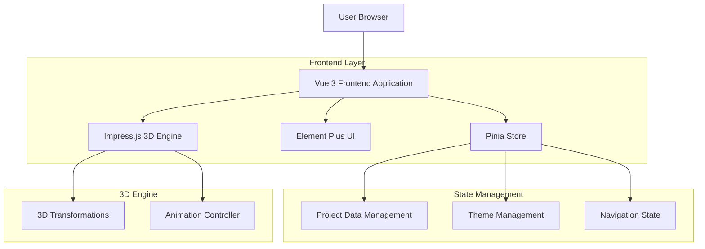
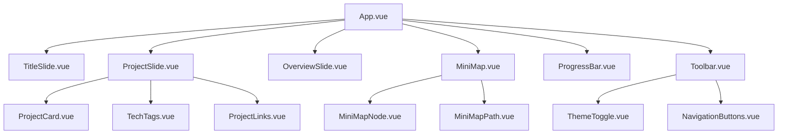

## 1. 架构设计



## 2. 技术描述

* **前端框架**：Vue 3\@3.4 + Composition API + TypeScript

* **UI 框架**：Element Plus\@2.4（提供基础组件支持）

* **状态管理**：Pinia\@2.1（替代 Vuex，提供更好的 TypeScript 支持）

* **3D 引擎**：Impress.js\@1.1（保持与原始项目相同的 3D 效果）

* **动画库**：GSAP\@3.13（用于复杂的动画效果）

* **图标库**：Font Awesome\@6.0（保持与原始项目一致的图标）

* **构建工具**：Vite\@5.0（快速的开发服务器和构建工具）

* **初始化工具**：vite-init

* **后端**：无（纯前端项目，数据通过配置文件管理）

## 3. 路由定义

本项目为单页应用，使用 impress.js 的 3D 导航机制，不采用传统的 Vue Router。页面切换通过 impress.js 的 API 实现。

| 路由标识       | 页面名称               | 用途        |
| ---------- | ------------------ | --------- |
| title      | 标题页                | 个人介绍和社交链接 |
| gwitter    | Gwitter 项目         | 项目详情展示    |
| homepage   | HomePage 项目        | 项目详情展示    |
| gallery    | AnimatedGallery 项目 | 项目详情展示    |
| termfolio  | TermFolio 项目       | 项目详情展示    |
| thinking   | 思考的价值 项目           | 项目详情展示    |
| scrcpy     | Scrcpy-GUI 项目      | 项目详情展示    |
| italking   | ITalking 项目        | 项目详情展示    |
| foliospace | FolioSpace 项目      | 项目详情展示    |
| overview   | 总览页                | 所有项目缩略图展示 |

## 4. 状态管理设计

### 4.1 Pinia Store 结构

```typescript
// stores/navigation.ts
export const useNavigationStore = defineStore('navigation', {
  state: () => ({
    currentSlide: 'title',
    isOverviewMode: false,
    totalSlides: 10,
    slideHistory: [] as string[],
  }),
  
  getters: {
    currentSlideIndex: (state) => {
      return SLIDE_ORDER.indexOf(state.currentSlide);
    },
    progress: (state) => {
      return (state.currentSlideIndex + 1) / state.totalSlides;
    },
  },
  
  actions: {
    setCurrentSlide(slideId: string) {
      this.currentSlide = slideId;
      this.slideHistory.push(slideId);
    },
    
    toggleOverviewMode() {
      this.isOverviewMode = !this.isOverviewMode;
    },
    
    navigateToSlide(slideId: string) {
      this.setCurrentSlide(slideId);
      // 调用 impress.js API 进行 3D 导航
      window.impress().goto(document.getElementById(slideId));
    },
  },
});
```

### 4.2 项目数据管理

```typescript
// stores/projects.ts
export const useProjectsStore = defineStore('projects', {
  state: () => ({
    projects: PROJECTS_DATA,
    mapData: MAP_DATA,
    githubStars: {} as Record<string, number>,
  }),
  
  getters: {
    completedProjects: (state) => {
      return state.projects.filter(p => p.status === 'completed');
    },
    
    inProgressProjects: (state) => {
      return state.projects.filter(p => p.status === 'in-progress');
    },
  },
  
  actions: {
    async fetchGitHubStars() {
      // 获取 GitHub 星标数据
      for (const project of this.projects) {
        const githubLink = project.links.find(link => link.type === 'code');
        if (githubLink?.githubRepo) {
          try {
            const stars = await fetchGitHubStars(githubLink.githubRepo);
            this.githubStars[project.id] = stars;
          } catch (error) {
            console.error(`Failed to fetch stars for ${project.id}:`, error);
          }
        }
      }
    },
  },
});
```

## 5. 组件架构

### 5.1 主要组件结构



### 5.2 组件通信

* **Props/Emits**：父子组件通信

* **Pinia Stores**：跨组件状态共享

* **Event Bus**：全局事件通信（主题切换、导航事件）

* **Provide/Inject**：深层组件树数据传递

## 6. 3D 效果实现

### 6.1 Impress.js 集成

```typescript
// composables/useImpress.ts
export function useImpress() {
  const navigationStore = useNavigationStore();
  
  const initImpress = () => {
    if (window.impress) {
      const impressAPI = window.impress();
      
      // 监听 impress.js 事件
      document.addEventListener('impress:stepenter', (event) => {
        const slideId = (event.target as Element).id;
        navigationStore.setCurrentSlide(slideId);
      });
      
      document.addEventListener('impress:stepleave', (event) => {
        // 处理离开事件
      });
      
      impressAPI.init();
    }
  };
  
  const navigateToSlide = (slideId: string) => {
    if (window.impress) {
      const element = document.getElementById(slideId);
      if (element) {
        window.impress().goto(element);
      }
    }
  };
  
  return {
    initImpress,
    navigateToSlide,
  };
}
```

### 6.2 3D 变换配置

保持与原始项目相同的 3D 变换参数：

```typescript
// constants/impressConfig.ts
export const IMPRESS_CONFIG = {
  TRANSITION_DURATION: 1200,
  MAX_SCALE: 3,
  MIN_SCALE: 0.5,
  PERSPECTIVE: 1200,
  WIDTH: 1200,
  HEIGHT: 800,
};

// constants/slidePositions.ts
export const SLIDE_POSITIONS = {
  TITLE: { x: 0, y: 0, z: 0, rotateY: 0 },
  GWITTER: { x: 1500, y: 0, z: 0, rotateY: 0 },
  HOMEPAGE: { x: 1200, y: 800, z: 200, rotateY: 30 },
  GALLERY: { x: 0, y: 1500, z: 400, rotateY: 90 },
  TERMFOLIO: { x: -1060, y: 1060, z: 600, rotateY: 135 },
  THINKING: { x: -1500, y: 0, z: 800, rotateY: 180 },
  SCRCPY: { x: -1060, y: -1060, z: 1000, rotateY: 225 },
  ITALKING: { x: 0, y: -1500, z: 1200, rotateY: 270 },
  PROJECTS: { x: 1060, y: -1060, z: 1400, rotateY: 315 },
  OVERVIEW: { x: 0, y: 0, z: 3000, rotateY: 0 },
};
```

## 7. 主题系统

### 7.1 主题切换实现

```typescript
// composables/useTheme.ts
export function useTheme() {
  const isDark = ref(false);
  
  const toggleTheme = () => {
    isDark.value = !isDark.value;
    document.documentElement.setAttribute('data-theme', isDark.value ? 'dark' : 'light');
    localStorage.setItem('theme', isDark.value ? 'dark' : 'light');
  };
  
  const initTheme = () => {
    const savedTheme = localStorage.getItem('theme');
    const prefersDark = window.matchMedia('(prefers-color-scheme: dark)').matches;
    
    isDark.value = savedTheme ? savedTheme === 'dark' : prefersDark;
    document.documentElement.setAttribute('data-theme', isDark.value ? 'dark' : 'light');
  };
  
  return {
    isDark,
    toggleTheme,
    initTheme,
  };
}
```

### 7.2 CSS 变量系统

保持与原始项目相同的 CSS 变量结构，支持主题切换：

```css
:root {
  --bg-primary: #FAFAFC;
  --bg-secondary: #FFFFFF;
  --text-primary: #1A1B23;
  --text-secondary: #6B7280;
  --accent-primary: #6366F1;
  --accent-hover: #4F46E5;
  /* ... 其他变量 */
}

[data-theme="dark"] {
  --bg-primary: #0F0F14;
  --bg-secondary: #1A1B23;
  --text-primary: #F9FAFB;
  --text-secondary: #D1D5DB;
  --accent-primary: #818CF8;
  --accent-hover: #6366F1;
  /* ... 其他变量 */
}
```

## 8. 性能优化

### 8.1 懒加载

* 项目图片采用懒加载策略

* impress.js 初始化和事件监听优化

### 8.2 动画优化

* 使用 CSS transform 和 opacity 进行动画（GPU 加速）

* 避免强制同步布局

* 使用 requestAnimationFrame 进行复杂动画

### 8.3 内存管理

* 组件卸载时清理事件监听

* 合理使用计算属性和侦听器

* 避免内存泄漏

